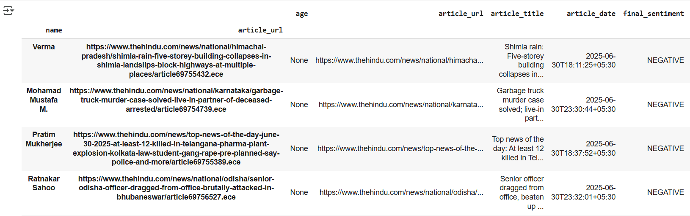

# 📰 Aspect-Based Sentiment Analysis on Indian News Articles

This project focuses on **aspect-based sentiment analysis** of news articles from two leading Indian news sources: **The Hindu** and **The Times of India**, with an emphasis on articles related to **crime, fraud, scams, and murder**.

## 📌 Objective

- Scrape and analyze crime-related news published in the last 48 hours.
- Extract **named entities (PERSON, AGE)**.
- Perform **aspect-based sentiment analysis** on people mentioned.
- Return structured sentiment profiles — especially for **negatively discussed individuals**.

---

## 🖼️ Output Visualization
**Negative Person Sentiment Extracted:**

- Negative Person Sentiment Extracted 
  

## 🧠 Methodology

### 🔹 A) Web Scraping

- **Sources**:  
  - [The Hindu](https://www.thehindu.com/)
  - [The Times of India](https://timesofindia.indiatimes.com/)

- **Data Collected**:
  - Article Title  
  - Full Article Content  
  - Publication Date  
  - Article URL  

- **Challenges**:
  - Times of India content required dynamic handling due to delayed loading.

---

### 🔹 B) Preprocessing

- Combined title + content for uniform inputs.
- Removed nulls, excessive whitespace.
- Tokenized content for sentence-level analysis.

---

### 🔹 C) Article Classification (Zero-Shot Learning)

- **Model**: `facebook/bart-large-mnli` via Hugging Face
- **Labels Used**: `["crime", "fraud", "murder", "scam", "non-crime"]`
- **Logic**:  
  - Average the confidence scores for `"crime", "fraud", "murder", "scam"`
  - Mark `is_crime_related = True` if the **average score ≥ 0.5**

---

### 🔹 D) Named Entity Recognition + Sentiment Analysis

- **NER Model**: `spaCy` - `en_core_web_sm`
- **Sentiment Model**: `cardiffnlp/twitter-roberta-base-sentiment`
  - Classifies into **Positive**, **Neutral**, or **Negative**
- For each PERSON:
  - Extract all sentences mentioning them
  - Apply sentiment model on each
  - Optionally extract **age** via regex (e.g., `22-year-old`)
  - Aggregate sentiment per person per article via **majority vote**

---

### 🔹 E) Output Structure

| Column Name         | Description                               |
|---------------------|-------------------------------------------|
| name                | Named entity of type PERSON               |
| age                 | Age if detected from sentence             |
| matched_sentence    | Sentence in which the person appears      |
| sentiment_label     | NEGATIVE / NEUTRAL / POSITIVE             |
| sentiment_score     | Confidence score of the predicted label   |
| article_url         | Link to the news article                  |
| article_title       | Title of the article                      |
| article_date        | Date of publication                       |

---

### ✅ Output Summary
| Metric                      | Value   |
|----------------------------|---------|
| Total articles scraped     | 126     |
| Crime-related articles     | 45      |
| Total named profiles       | 301     |
| Negative profiles extracted| 62      |

---- 

## 📁 Output Files

- `all_profiles_sentiment_output.xlsx`: All extracted person-sentiment profiles  
- `negative_profiles_sentiment_output.xlsx`: Subset with **negative sentiment**

---

